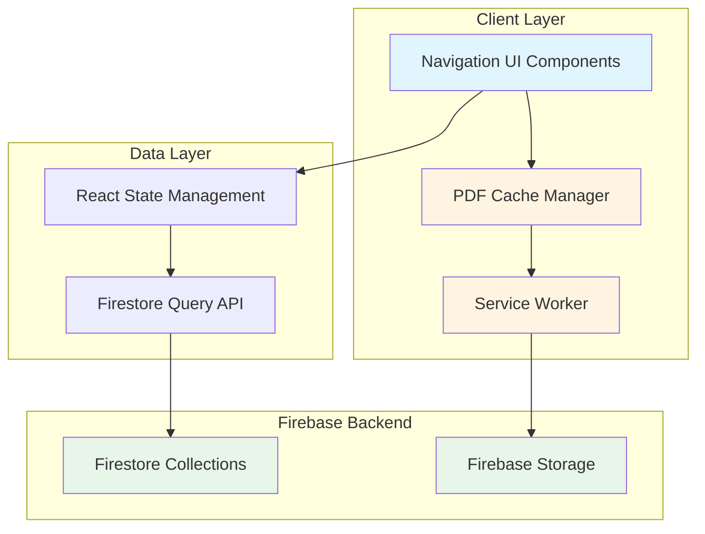
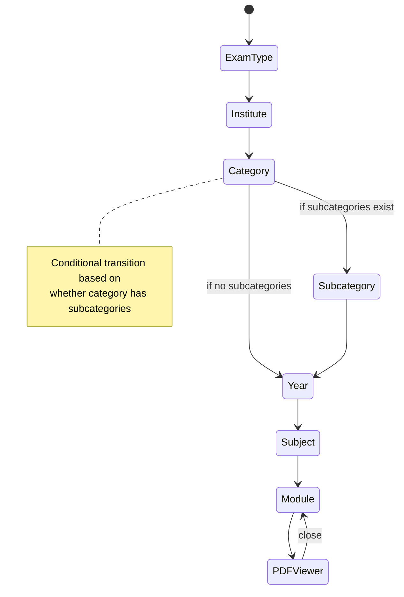

# Design Document: Resources Hierarchical Navigation

## Overview

This design extends the existing Resources feature from a 3-level navigation system (Institute → Subject → Module) to a comprehensive 6-level hierarchical navigation system (Exam Type → Institute → Category → Year → Subject → Module) with dynamic category management, subcategory support, and client-side PDF caching for improved performance.

### Key Design Goals

1. **Extensible Hierarchy**: Support a flexible 6-level navigation structure that can accommodate future organizational needs
2. **Dynamic Configuration**: Enable administrators to manage hierarchy levels (exam types, institutes, categories, subcategories, years) without code changes
3. **Performance Optimization**: Implement client-side PDF caching to eliminate redundant downloads and provide instant access to previously viewed materials
4. **Backward Compatibility**: Ensure existing resources remain accessible during and after the migration
5. **User Experience**: Provide intuitive navigation with breadcrumbs, search/filter capabilities, and clear visual feedback

### Current System Analysis

The existing implementation uses:
- **Frontend**: Next.js 15 with React 19, TypeScript, Tailwind CSS
- **Backend**: Firebase Firestore for metadata storage, Firebase Storage for PDF files
- **State Management**: React hooks (useState) for local component state
- **Data Model**: Flat `resources` collection with `institute`, `subject`, and module metadata

The current system is limited to a fixed 3-level hierarchy and lacks caching, making it unsuitable for the expanded organizational requirements.

## Architecture

### High-Level Architecture



### Component Architecture

The system follows a layered architecture:

1. **Presentation Layer**: React components for navigation, breadcrumbs, PDF viewing
2. **State Management Layer**: React hooks managing navigation state and data fetching
3. **Data Access Layer**: Firestore query functions and cache management utilities
4. **Caching Layer**: Service Worker intercepting PDF requests and managing Cache API
5. **Backend Layer**: Firestore collections for metadata and Firebase Storage for PDF files

### Navigation State Machine

The navigation follows a state machine pattern where each level depends on selections from previous levels:



## Components and Interfaces

### Core Components

#### 1. HierarchyNavigator Component

**Purpose**: Main orchestrator component managing the entire navigation flow

**Props**:
```typescript
interface HierarchyNavigatorProps {
  initialState?: NavigationState;
  onModuleSelect?: (module: ResourceModule) => void;
}
```

**State**:
```typescript
interface NavigationState {
  examType: string | null;
  institute: string | null;
  category: string | null;
  subcategory: string | null;
  year: string | null;
  subject: string | null;
  selectedModule: ResourceModule | null;
}
```

**Responsibilities**:
- Maintain navigation state across all hierarchy levels
- Coordinate data fetching for each level
- Manage loading and error states
- Render appropriate child components based on current level

#### 2. BreadcrumbNavigation Component

**Purpose**: Display current navigation path and enable quick navigation to previous levels

**Props**:
```typescript
interface BreadcrumbNavigationProps {
  path: NavigationPath[];
  onNavigate: (level: HierarchyLevel) => void;
}

interface NavigationPath {
  level: HierarchyLevel;
  label: string;
  value: string;
}

type HierarchyLevel = 'examType' | 'institute' | 'category' | 'subcategory' | 'year' | 'subject' | 'module';
```

**Behavior**:
- Renders clickable breadcrumb items for each selected level
- Clicking a breadcrumb navigates to that level and clears subsequent selections
- Wraps to multiple lines on narrow screens
- Uses ARIA labels for accessibility

#### 3. LevelSelector Component

**Purpose**: Generic reusable component for selecting an option at any hierarchy level

**Props**:
```typescript
interface LevelSelectorProps<T> {
  title: string;
  items: T[];
  selectedId: string | null;
  onSelect: (item: T) => void;
  fetchState: FetchState;
  onRetry?: () => void;
  searchable?: boolean;
  renderItem?: (item: T) => React.ReactNode;
  emptyMessage?: string;
}
```

**Features**:
- Grid layout for items with responsive columns
- Optional search/filter functionality
- Loading, error, and empty states
- Keyboard navigation support
- Touch-friendly sizing on mobile

#### 4. PDFCacheManager

**Purpose**: Manage PDF caching operations and storage limits

**Interface**:
```typescript
interface PDFCacheManager {
  // Check if a PDF is cached
  isCached(url: string): Promise<boolean>;
  
  // Get cached PDF or fetch from network
  getPDF(url: string, metadata: PDFMetadata): Promise<Blob>;
  
  // Manually clear all cached PDFs
  clearCache(): Promise<void>;
  
  // Get current cache size in bytes
  getCacheSize(): Promise<number>;
  
  // Get cache statistics
  getCacheStats(): Promise<CacheStats>;
}

interface PDFMetadata {
  id: string;
  version: string;
  size: number;
}

interface CacheStats {
  totalSize: number;
  itemCount: number;
  oldestAccess: Date;
  newestAccess: Date;
}
```

**Implementation Strategy**:
- Uses Cache API for storing PDF blobs
- Stores metadata (access timestamps, versions, sizes) in IndexedDB
- Implements LRU (Least Recently Used) eviction when size exceeds 100MB
- Runs cleanup asynchronously to avoid blocking UI

#### 5. AdminHierarchyManager Component

**Purpose**: Administrative interface for managing hierarchy configuration

**Features**:
- Tabbed interface for each hierarchy level (Exam Types, Institutes, Categories, Subcategories, Years)
- CRUD operations for each level
- Drag-and-drop reordering
- Validation to prevent deletion of items with associated resources
- Real-time updates reflected across all users

#### 6. AdminPDFManager Component

**Purpose**: Administrative interface for managing PDF resources

**Features**:
- Upload form with all hierarchy level selectors
- Conditional subcategory field based on selected category
- List view of all PDFs with metadata
- Edit and delete operations
- Bulk operations (delete, change category, change year)
- Search and filter capabilities

### Service Worker

**Purpose**: Intercept PDF requests and implement caching strategy

**Caching Strategy**:
```typescript
// Cache-first strategy for PDFs
async function handlePDFRequest(request: Request): Promise<Response> {
  const cache = await caches.open('pdf-cache-v1');
  
  // Check cache first
  const cachedResponse = await cache.match(request);
  if (cachedResponse) {
    // Verify version is current
    const metadata = await getMetadataFromIndexedDB(request.url);
    const currentVersion = await fetchCurrentVersion(request.url);
    
    if (metadata.version === currentVersion) {
      // Update access timestamp
      await updateAccessTimestamp(request.url);
      return cachedResponse;
    }
  }
  
  // Fetch from network
  const networkResponse = await fetch(request);
  
  // Cache the response
  await cache.put(request, networkResponse.clone());
  await storeMetadata(request.url, {
    version: currentVersion,
    accessTime: Date.now(),
    size: parseInt(networkResponse.headers.get('content-length') || '0')
  });
  
  // Check cache size and evict if necessary
  await enforceStorageLimit();
  
  return networkResponse;
}
```

**Storage Limit Enforcement**:
```typescript
async function enforceStorageLimit(): Promise<void> {
  const MAX_CACHE_SIZE = 100 * 1024 * 1024; // 100 MB
  
  const metadata = await getAllMetadataFromIndexedDB();
  const totalSize = metadata.reduce((sum, item) => sum + item.size, 0);
  
  if (totalSize > MAX_CACHE_SIZE) {
    // Sort by access time (oldest first)
    metadata.sort((a, b) => a.accessTime - b.accessTime);
    
    // Remove items until under limit
    let currentSize = totalSize;
    for (const item of metadata) {
      if (currentSize <= MAX_CACHE_SIZE) break;
      
      await removeFromCache(item.url);
      await removeMetadata(item.url);
      currentSize -= item.size;
    }
  }
}
```

## Data Models

### Firestore Collections

#### 1. examTypes Collection

```typescript
interface ExamType {
  id: string;           // Auto-generated document ID
  name: string;         // Display name (e.g., "NEET", "JEE")
  sortOrder: number;    // Display order
  createdAt: Timestamp;
  updatedAt: Timestamp;
}
```

**Indexes**:
- `sortOrder` (ascending)

#### 2. institutes Collection

```typescript
interface Institute {
  id: string;           // Auto-generated document ID
  name: string;         // Display name (e.g., "ALLEN", "AAKASH")
  identifier: string;   // Unique identifier for queries
  sortOrder: number;
  createdAt: Timestamp;
  updatedAt: Timestamp;
}
```

**Indexes**:
- `sortOrder` (ascending)
- `identifier` (ascending)

#### 3. categories Collection

```typescript
interface Category {
  id: string;
  name: string;         // e.g., "Modules", "Test Series", "Notes"
  sortOrder: number;
  hasSubcategories: boolean;  // Flag to determine if subcategory level is needed
  createdAt: Timestamp;
  updatedAt: Timestamp;
}
```

**Indexes**:
- `sortOrder` (ascending)

#### 4. subcategories Collection

```typescript
interface Subcategory {
  id: string;
  categoryId: string;   // Reference to parent category
  name: string;         // e.g., "Leader Test Series", "Classroom Major Series"
  sortOrder: number;
  createdAt: Timestamp;
  updatedAt: Timestamp;
}
```

**Indexes**:
- Composite: `categoryId` (ascending), `sortOrder` (ascending)

#### 5. years Collection

```typescript
interface Year {
  id: string;
  year: number;         // e.g., 2024, 2025
  sortOrder: number;    // For custom ordering (typically descending)
  createdAt: Timestamp;
  updatedAt: Timestamp;
}
```

**Indexes**:
- `sortOrder` (descending)

#### 6. resources Collection (Enhanced)

```typescript
interface ResourceDocument {
  id: string;
  
  // Hierarchy fields
  examType: string;         // Reference to examTypes.id
  institute: string;        // Reference to institutes.identifier
  category: string;         // Reference to categories.id
  subcategory?: string;     // Optional reference to subcategories.id
  year: number;             // Year value
  subject: string;          // Subject name (Physics, Chemistry, Biology, Mathematics)
  
  // Module metadata
  displayName: string;      // Display name for the module
  pdfUrl: string;          // Firebase Storage URL
  sortOrder: number;       // Display order within subject
  
  // Optional metadata
  chapterName?: string;
  topicName?: string;
  
  // Versioning for cache invalidation
  version: string;         // UUID or timestamp-based version identifier
  fileSize: number;        // Size in bytes
  
  // Legacy support
  isLegacy: boolean;       // Flag for resources uploaded before hierarchy expansion
  
  // Audit fields
  createdAt: Timestamp;
  updatedAt: Timestamp;
  createdBy: string;       // User ID
  updatedBy: string;       // User ID
}
```

**Indexes** (Composite):
1. `examType` (asc), `institute` (asc), `category` (asc), `year` (asc), `subject` (asc), `sortOrder` (asc)
2. `examType` (asc), `institute` (asc), `category` (asc), `subcategory` (asc), `year` (asc), `subject` (asc), `sortOrder` (asc)
3. `isLegacy` (asc), `institute` (asc), `subject` (asc), `sortOrder` (asc) - for backward compatibility

#### 7. auditLogs Collection

```typescript
interface AuditLog {
  id: string;
  userId: string;          // Administrator who performed the action
  action: AuditAction;     // Type of action performed
  entityType: EntityType;  // Type of entity affected
  entityId: string;        // ID of affected entity
  changes?: Record<string, any>;  // Before/after values for updates
  timestamp: Timestamp;
  ipAddress?: string;
  userAgent?: string;
}

type AuditAction = 'create' | 'update' | 'delete' | 'bulk_delete' | 'bulk_update';
type EntityType = 'examType' | 'institute' | 'category' | 'subcategory' | 'year' | 'resource';
```

**Indexes**:
- Composite: `timestamp` (desc), `userId` (asc)
- Composite: `entityType` (asc), `timestamp` (desc)

### IndexedDB Schema

**Database Name**: `resources-cache-db`

**Object Stores**:

#### 1. pdfMetadata Store

```typescript
interface PDFCacheMetadata {
  url: string;              // Primary key
  version: string;          // Version identifier from Firestore
  size: number;             // File size in bytes
  accessTime: number;       // Last access timestamp (ms since epoch)
  cacheTime: number;        // When it was cached (ms since epoch)
}
```

**Indexes**:
- `accessTime` (ascending) - for LRU eviction
- `cacheTime` (ascending) - for analytics

### TypeScript Type Definitions

```typescript
// Navigation types
export type HierarchyLevel = 
  | 'examType' 
  | 'institute' 
  | 'category' 
  | 'subcategory' 
  | 'year' 
  | 'subject' 
  | 'module';

export interface NavigationState {
  examType: string | null;
  institute: string | null;
  category: string | null;
  subcategory: string | null;
  year: string | null;
  subject: string | null;
  selectedModule: ResourceModule | null;
}

export interface HierarchyOption {
  id: string;
  name: string;
  sortOrder: number;
}

// Fetch state
export type FetchState = 'idle' | 'loading' | 'success' | 'error';

// Cache types
export interface CacheStatus {
  isCached: boolean;
  isDownloading: boolean;
  progress?: number;
}

export interface CacheStats {
  totalSize: number;
  itemCount: number;
  oldestAccess: Date;
  newestAccess: Date;
}
```

## Correctness Properties

*A property is a characteristic or behavior that should hold true across all valid executions of a system—essentially, a formal statement about what the system should do. Properties serve as the bridge between human-readable specifications and machine-verifiable correctness guarantees.*

Before writing correctness properties, I need to analyze the acceptance criteria to determine which are suitable for property-based testing.

